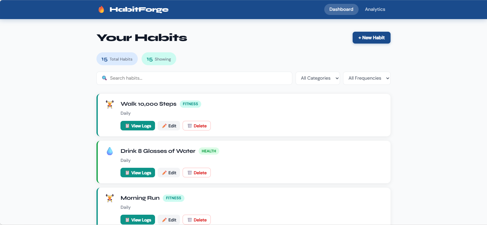

# HabitForge - Habit & Consistency Tracker



**Authors:** Aniket Nandi, Runze (Neil) Wang  
**Course:** [CS 5610 Web Development](https://app.slack.com/client/T09D5U3U8A1/C09D5U47DK7)  
**Project:** Final Project: Iterating your full stack application with design, accessibility and usability

---
## Project Objective

HabitForge is a personal productivity and consistency tracking platform that helps users build and maintain structured habits, from daily coding practice and gym workouts to reading and interview preparation.

Users can:
- Create, edit, and delete habits with daily or weekly frequency targets
- Log completions by date and view full history
- Track current and longest streaks
- Analyze weekly completion percentages
- Sort habits by completion rate, streak, or name
- Filter analytics by custom date range

---
## Tech Stack
|Layer      | Technology                      |
|-----------|---------------------------------|
|Backend    | Node.js + Express               |
|Database   | MongoDB (native Node.js driver) |
|Frontend   | React 18 with Hooks             |
|Routing    | React Router v6                 |
|Build      | Vite                            |

---
## Live Demo
https://habit-forge-final-project.onrender.com

---
## Design Decisions

### Typography
HabitForge uses **Syne** as the display font for headings and **DM Sans** as the body font. Syne's bold geometric style 
conveys structure and consistency, matching the app's focus on building habits. DM Sans provides clean, readable body text.

### Color Palette
| Color | Hex | Usage |
|-------|-----|-------|
| Navy Blue | `#1a4b8c` | Primary actions, navigation |
| Teal | `#0d9488` | Secondary actions, streaks |
| Orange | `#ea580c` | Goals, highlights |
| Red | `#dc2626` | Destructive actions |
| Green | `#16a34a` | Success states |

Approve actions always use blue or teal. Cancel always uses gray. Destructive always uses red.

### Accessibility
The app passes Lighthouse accessibility audit with 100% score. All interactive elements are keyboard accessible, a 
skip-to-content link is provided, all form inputs have associated labels, and ARIA roles are used throughout.

### Usability Study Improvements
Based on the usability study findings, the following improvements were implemented:
- Added "This Year" date range filter preset to Analytics
- Also added "Today", "Past Month", and "Past Week" date range filter preset to Analytics inspired by "This Year" preset
- Added quick-fill note suggestions when logging a habit completion

The following were considered but not implemented:
- Google SSO would require commercial email services introducing additional cost
- "Flattened 0s" on analytics and similar color tiles are user-specific perceptions and do not affect functionality
- Additional habit categories were flagged as a nice-to-have and not a core usability issue
- Minor individual preferences were not actioned as they did not represent patterns across participants

---
## Test Account
- **Username:** testuser
- **Password:** password123

---
## Demo Video
https://youtu.be/vYcBYF3roz8

---
## How to Use the App

0. **Register / Login** - Create a new account at the Register page, or use the test account: username `testuser`, password `password123`.
1. **Dashboard** - Your home screen. See all habits at a glance. Use the search bar and filters to narrow by category or frequency.
2. **+ New Habit** - Click the button to create a habit. Give it a name, category, and frequency (daily or number of times per week).
3. **View Logs** - Click "📋 View Logs" on any habit card to see its completion history. Log a new completion by picking a date (past or today) and clicking "+ Log Completion".
4. **Edit / Delete** - Use ✏️ Edit to update a habit or 🗑️ Delete to remove it (and all its logs).
5. **Analytics** - Navigate to the Analytics tab to see streaks, weekly completion percentages, and overall stats for all habits. Use the date range filter and sort controls to explore trends.
---
## Instructions to Build

### Prerequisites

- Node.js v18+
- A MongoDB Atlas cluster (or local MongoDB)
- `npm` or `pnpm`

### 1. Clone the repository

```bash
git clone https://github.com/aniketnandi/Habit-Forge.git
cd Habit-Forge
```

### 2. Set up the backend

```bash
cd backend
npm install
cp .env.example .env
# Edit .env and set MONGO_URI to your MongoDB connection string
```

### 3. Seed the database (1,000+ synthetic records)

```bash
npm run seed
```

### 4. Start the backend server

```bash
npm run dev   # development (nodemon)
# or
npm start   # production
```

Backend runs on `http://localhost:5000`

### 5. Set up the frontend

```bash
cd ../frontend
npm install
```

### 6. Start the frontend dev server

```bash
npm run dev
```

Frontend runs on `http://localhost:5173` and proxies `/api` calls to the backend.

### 7. Build for production

```bash
npm run build   # outputs to frontend/dist/
```

---
## Project Structure
```aiignore
Habit Forge/
|--- backend/
|     |--- middleware/
|     |     |--- requireAuth.js
|     |--- db/
|     |     |--- connection.js
|     |     |--- seed.js
|     |     |--- passport.js
|     |--- routes/
|     |     |--- habits.js
|     |     |--- logs.js
|     |     |--- analytics.js
|     |     |--- goals.js
|     |     |--- auth.js
|     |--- server.js
|     |--- package.json
|--- frontend/
|     |--- src/
|     |     |--- context/
|     |     |     |--- UserContext.jsx
|     |     |--- components/
|     |     |     |--- Login/
|     |     |     |--- Register/
|     |     |     |--- Navbar/
|     |     |     |--- Dashboard/
|     |     |     |--- HabitCard/
|     |     |     |--- HabitForm/
|     |     |     |--- LogView/
|     |     |     |--- LogEntry/
|     |     |     |--- Analytics/
|     |     |     |--- HabitAnalyticsRow/
|     |     |     |--- DateRangeFilter/
|     |     |     |--- ProgressBar/
|     |     |     |--- SortControls/
|     |     |     |--- GoalForm/
|     |     |--- api.js
|     |     |--- App.jsx
|     |     |--- main.jsx
|     |     |--- index.css
|     |--- index.html
|     |--- package.json
```

---
## MongoDB Collections

| Collection | Description                                   | CRUD Owner                             |
|------------|-----------------------------------------------|----------------------------------------|
| `habits`   | Habit definitions (name, category, frequency) | Aniket (full CRUD)                     |
| `logs`     | Completion log entries per habit              | Aniket (C/R/D), Neil (R for analytics) |
| `goals`    | Weekly goal targets per habit                 | Neil (full CRUD)                       |
| `users`    | User accounts (username, hashed password)     | Aniket (Register), Neil (Login/Logout) |

---
## License

[MIT](./LICENSE)